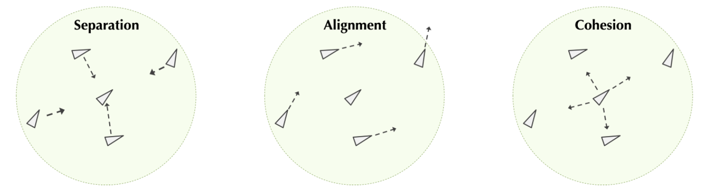

# 🕊️ Boids Simulation

[]()
[]()
[]()

This is a course project in **Programming for Scientist**

## ✨ Overview
This project simulates the collective motion of boids using three behavioral rules:  
**Separation**, **Alignment**, and **Cohesion**.  
Each boid acts independently but interacts with nearby boids within a threshold distance.

<p align="center">
  
</p>


## 🧩 Algorithm
### Three principles were considered in the simulation:
1. **Seperation**: boids try to avoid collisions with other nearby boids.
2. **Alignment**: boids try to match the velocities of nearby boids.
3. **Cohesion**: boids try to remain close to nearby boids, keeping the flock together.



Each boid changes its behavior independently. Also, each of the three rules will only be applied if two boids are within a threshold distance.

### Computing the seperation force
If `boid_1` and `boid_2` are within the threshold distance, the force acting on `boid_1` due to seperation force with `boid_2` is computed as:

F_x = c_separation * (x1 - x2) / d^2

F_y = c_separation * (y1 - y2) / d^2

where `c_separation` is a constant factor called **separation factor**.

### Computing the alignment force
If `boid_1` and `boid_2` are within the threshold distance, the force acting on `boid_1` due to alignment force with `boid_2` is computed as:

F_x = c_alignment * v_x / d

F_y = c_alignment * v_y / d

where `c_alignment` is a constant factor called **alignment factor**.

### Computing the cohesion force
If `boid_1` and `boid_2` are within the threshold distance, the force acting on `boid_1` due to cohesion force with `boid_2` is computed as:

F_x = c_cohesion * (x2 - x1) / d

F_y = c_cohesion * (y2 - y1) / d

where `c_cohesion` is a constant factor called **cohesion factor**.

### Limiting boid speed
We ensured that the boids cannot fly too fast because this model was intended to model birds. Therefore, there was an additional parameter `maxBoidSpeed` representing the maximum speed of the boids.

Assuming a boid with velocity `(v_x, v_y)` and the speed `s`. In each time step, if `s > maxBoidSpeed`, the speed will be scaled down by a factor of `maxBoidSpeed / s`:

v_x = v_x * (maxBoidSpeed / s)

v_y = v_y * (maxBoidSpeed / s)

If the speed `s` is smaller than `maxBoidSpeed`, no adjustment for the boid's velocity is needed.

---
## 📁 File Structure
```
Boids/
│
├── main.go # Entry point
├── datatypes.go # Boid structures
├── functions.go # Functions for simulation
├── functions_test.go # test functions for subroutines
├── drawing.go # GIF visualization
├── Tests/ 
│ └── ComputeAlignmentForce/ # Test data and expected output for function `ComputeAlignmentForce`
│ └── ComputeCohesionForce/ # Test data and expected output for function `ComputeCohesionForce`
│ └── ComputeSeparationForce/ # Test data and expected output for function `ComputeSeparationForce`
│ └── Distance/ # Test data and expected output for function `Distance`
├── output/
│ └── test_boids.gif # GIF outputs 
└── README.md
```

---

## 👩‍💻 Author

Developed by **Helen9125**  
For educational purposes.
